# Design Tools Tab - Visual Diagrams
**Generated**: 2025-01-XX  
**Purpose**: Visual representation of architecture, data flows, and workflows

---

## 1. Architecture Component Diagram

```mermaid
graph TB
    subgraph "Design Tools Tab (View/Controller)"
        DTT[DesignToolsTab]
    end
    
    subgraph "Core Managers"
        PS[PatternState<br/>Single Source of Truth]
        FM[FrameManager<br/>Frame Operations]
        LM[LayerManager<br/>Multi-layer Support]
        CC[CanvasController<br/>Canvas Rendering]
        AQM[AutomationQueueManager<br/>Automation Actions]
        HM[HistoryManager<br/>Undo/Redo]
        SM[ScratchpadManager<br/>Temporary Storage]
        EL[EffectLibrary<br/>Visual Effects]
        BFR[BitmapFontRepository<br/>Font Assets]
        PR[PresetRepository<br/>Automation Presets]
    end
    
    subgraph "Data Structures"
        PIS[PatternInstructionSequence<br/>LMS Instructions]
    end
    
    subgraph "UI Components"
        CANVAS[MatrixDesignCanvas]
        TIMELINE[TimelineWidget]
        LAYER_PANEL[LayerPanelWidget]
        EFFECTS_UI[EffectsLibraryWidget]
    end
    
    subgraph "Utilities"
        EXPORT[Export/Import System]
        IMG_IMPORT[ImageImporter]
        PREVIEW[PreviewSimulator]
    end
    
    DTT --> PS
    DTT --> FM
    DTT --> LM
    DTT --> CC
    DTT --> AQM
    DTT --> HM
    DTT --> SM
    DTT --> EL
    DTT --> BFR
    DTT --> PR
    DTT --> PIS
    DTT --> EXPORT
    DTT --> IMG_IMPORT
    DTT --> PREVIEW
    
    FM --> PS
    LM --> PS
    CC --> PS
    CC --> LM
    
    DTT --> CANVAS
    DTT --> TIMELINE
    DTT --> LAYER_PANEL
    DTT --> EFFECTS_UI
    
    CANVAS --> LM
    TIMELINE --> FM
    LAYER_PANEL --> LM
    EFFECTS_UI --> EL
    
    AQM --> PIS
    PREVIEW --> PIS
    EXPORT --> PIS
```

---

## 2. Data Flow: Pattern Loading

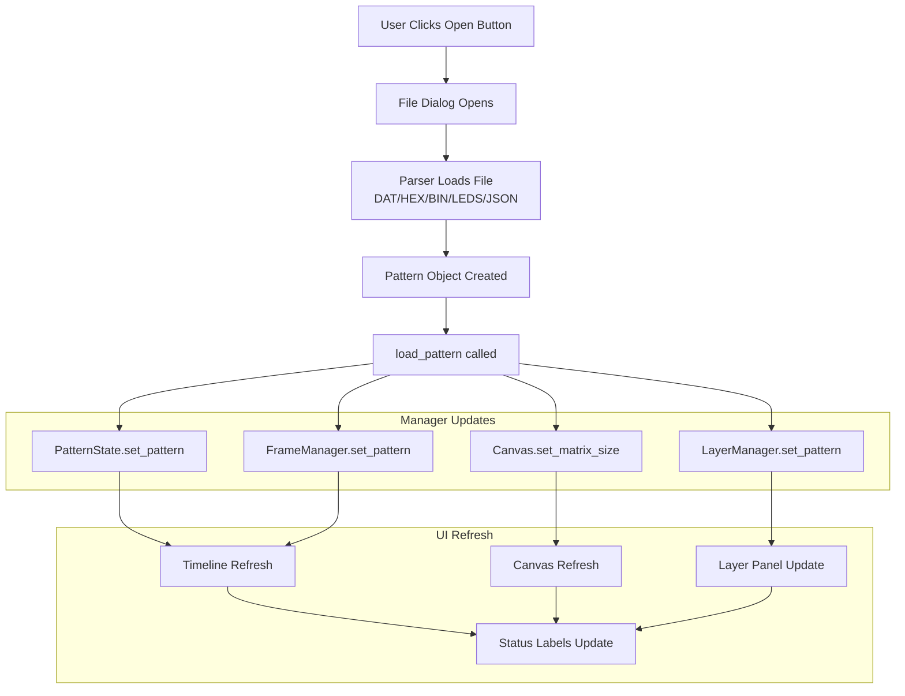
```mermaid
flowchart TD
    START[User Clicks Open Button]
    FILE_DIALOG[File Dialog Opens]
    PARSER[Parser Loads File<br/>DAT/HEX/BIN/LEDS/JSON]
    PATTERN_CREATE[Pattern Object Created]
    LOAD_PATTERN[load_pattern called]
    
    subgraph "Manager Updates"
        PS_SET[PatternState.set_pattern]
        FM_SET[FrameManager.set_pattern]
        LM_SET[LayerManager.set_pattern]
        CANVAS_SIZE[Canvas.set_matrix_size]
    end
    
    subgraph "UI Refresh"
        TIMELINE_REF[Timeline Refresh]
        CANVAS_REF[Canvas Refresh]
        LAYER_REF[Layer Panel Update]
        STATUS_REF[Status Labels Update]
    end
    
    START --> FILE_DIALOG
    FILE_DIALOG --> PARSER
    PARSER --> PATTERN_CREATE
    PATTERN_CREATE --> LOAD_PATTERN
    
    LOAD_PATTERN --> PS_SET
    LOAD_PATTERN --> FM_SET
    LOAD_PATTERN --> LM_SET
    LOAD_PATTERN --> CANVAS_SIZE
    
    PS_SET --> TIMELINE_REF
    FM_SET --> TIMELINE_REF
    LM_SET --> LAYER_REF
    CANVAS_SIZE --> CANVAS_REF
    
    TIMELINE_REF --> STATUS_REF
    CANVAS_REF --> STATUS_REF
    LAYER_REF --> STATUS_REF
```

---

## 3. Data Flow: Pixel Painting

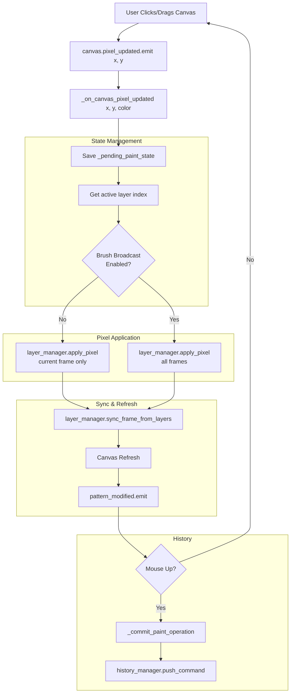
```mermaid
flowchart TD
    START[User Clicks/Drags Canvas]
    SIGNAL[canvas.pixel_updated.emit x, y]
    HANDLER[_on_canvas_pixel_updated x, y, color]
    
    subgraph "State Management"
        SAVE_STATE[Save _pending_paint_state]
        GET_LAYER[Get active layer index]
        CHECK_BROADCAST{Brush Broadcast<br/>Enabled?}
    end
    
    subgraph "Pixel Application"
        APPLY_SINGLE[layer_manager.apply_pixel<br/>current frame only]
        APPLY_ALL[layer_manager.apply_pixel<br/>all frames]
    end
    
    subgraph "Sync & Refresh"
        SYNC[layer_manager.sync_frame_from_layers]
        CANVAS_UPDATE[Canvas Refresh]
        SIGNAL_EMIT[pattern_modified.emit]
    end
    
    subgraph "History"
        MOUSE_UP{Mouse Up?}
        COMMIT[_commit_paint_operation]
        HISTORY[history_manager.push_command]
    end
    
    START --> SIGNAL
    SIGNAL --> HANDLER
    HANDLER --> SAVE_STATE
    SAVE_STATE --> GET_LAYER
    GET_LAYER --> CHECK_BROADCAST
    
    CHECK_BROADCAST -->|Yes| APPLY_ALL
    CHECK_BROADCAST -->|No| APPLY_SINGLE
    
    APPLY_SINGLE --> SYNC
    APPLY_ALL --> SYNC
    
    SYNC --> CANVAS_UPDATE
    CANVAS_UPDATE --> SIGNAL_EMIT
    
    SIGNAL_EMIT --> MOUSE_UP
    MOUSE_UP -->|Yes| COMMIT
    MOUSE_UP -->|No| START
    COMMIT --> HISTORY
```

---

## 4. Sequence Diagram: Canvas Drawing with Layers

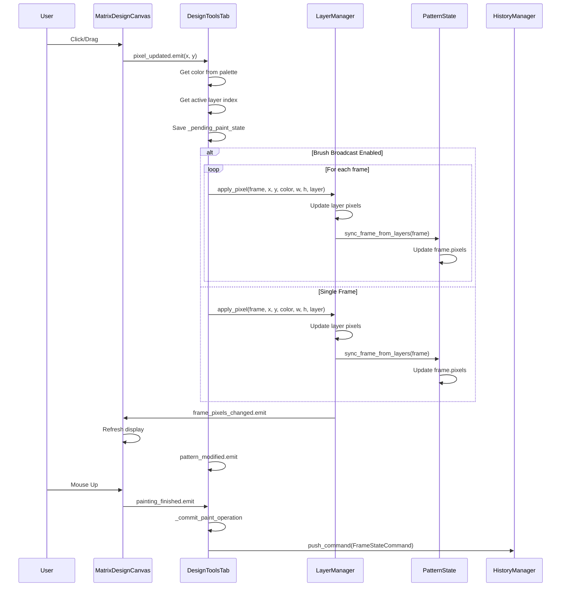
```mermaid
sequenceDiagram
    participant User
    participant Canvas as MatrixDesignCanvas
    participant DTT as DesignToolsTab
    participant LM as LayerManager
    participant PS as PatternState
    participant HM as HistoryManager
    
    User->>Canvas: Click/Drag
    Canvas->>DTT: pixel_updated.emit(x, y)
    DTT->>DTT: Get color from palette
    DTT->>DTT: Get active layer index
    DTT->>DTT: Save _pending_paint_state
    
    alt Brush Broadcast Enabled
        loop For each frame
            DTT->>LM: apply_pixel(frame, x, y, color, w, h, layer)
            LM->>LM: Update layer pixels
            LM->>PS: sync_frame_from_layers(frame)
            PS->>PS: Update frame.pixels
        end
    else Single Frame
        DTT->>LM: apply_pixel(frame, x, y, color, w, h, layer)
        LM->>LM: Update layer pixels
        LM->>PS: sync_frame_from_layers(frame)
        PS->>PS: Update frame.pixels
    end
    
    LM->>Canvas: frame_pixels_changed.emit
    Canvas->>Canvas: Refresh display
    DTT->>DTT: pattern_modified.emit
    
    User->>Canvas: Mouse Up
    Canvas->>DTT: painting_finished.emit
    DTT->>DTT: _commit_paint_operation
    DTT->>HM: push_command(FrameStateCommand)
```

---

## 5. Sequence Diagram: Frame Management

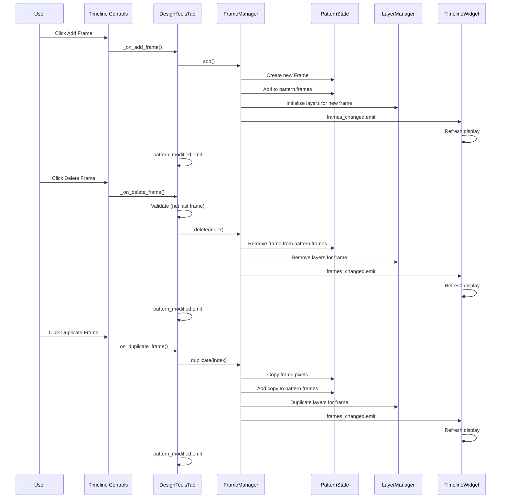
```mermaid
sequenceDiagram
    participant User
    participant UI as Timeline Controls
    participant DTT as DesignToolsTab
    participant FM as FrameManager
    participant PS as PatternState
    participant LM as LayerManager
    participant Timeline as TimelineWidget
    
    User->>UI: Click Add Frame
    UI->>DTT: _on_add_frame()
    DTT->>FM: add()
    FM->>PS: Create new Frame
    FM->>PS: Add to pattern.frames
    FM->>LM: Initialize layers for new frame
    FM->>Timeline: frames_changed.emit
    Timeline->>Timeline: Refresh display
    DTT->>DTT: pattern_modified.emit
    
    User->>UI: Click Delete Frame
    UI->>DTT: _on_delete_frame()
    DTT->>DTT: Validate (not last frame)
    DTT->>FM: delete(index)
    FM->>PS: Remove frame from pattern.frames
    FM->>LM: Remove layers for frame
    FM->>Timeline: frames_changed.emit
    Timeline->>Timeline: Refresh display
    DTT->>DTT: pattern_modified.emit
    
    User->>UI: Click Duplicate Frame
    UI->>DTT: _on_duplicate_frame()
    DTT->>FM: duplicate(index)
    FM->>PS: Copy frame pixels
    FM->>PS: Add copy to pattern.frames
    FM->>LM: Duplicate layers for frame
    FM->>Timeline: frames_changed.emit
    Timeline->>Timeline: Refresh display
    DTT->>DTT: pattern_modified.emit
```

---

## 6. Sequence Diagram: Undo/Redo

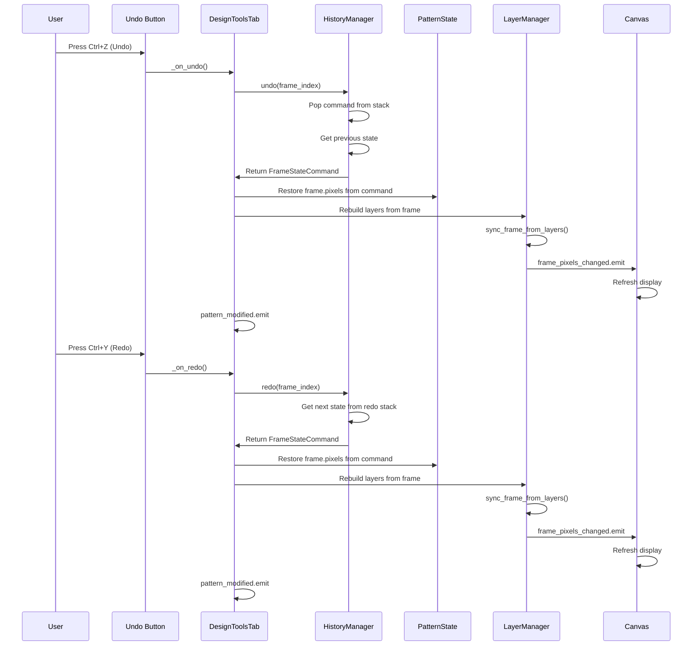
```mermaid
sequenceDiagram
    participant User
    participant UI as Undo Button
    participant DTT as DesignToolsTab
    participant HM as HistoryManager
    participant PS as PatternState
    participant LM as LayerManager
    participant Canvas
    
    User->>UI: Press Ctrl+Z (Undo)
    UI->>DTT: _on_undo()
    DTT->>HM: undo(frame_index)
    HM->>HM: Pop command from stack
    HM->>HM: Get previous state
    HM->>DTT: Return FrameStateCommand
    
    DTT->>PS: Restore frame.pixels from command
    DTT->>LM: Rebuild layers from frame
    LM->>LM: sync_frame_from_layers()
    LM->>Canvas: frame_pixels_changed.emit
    Canvas->>Canvas: Refresh display
    DTT->>DTT: pattern_modified.emit
    
    User->>UI: Press Ctrl+Y (Redo)
    UI->>DTT: _on_redo()
    DTT->>HM: redo(frame_index)
    HM->>HM: Get next state from redo stack
    HM->>DTT: Return FrameStateCommand
    
    DTT->>PS: Restore frame.pixels from command
    DTT->>LM: Rebuild layers from frame
    LM->>LM: sync_frame_from_layers()
    LM->>Canvas: frame_pixels_changed.emit
    Canvas->>Canvas: Refresh display
    DTT->>DTT: pattern_modified.emit
```

---

## 7. State Transition: Pattern State

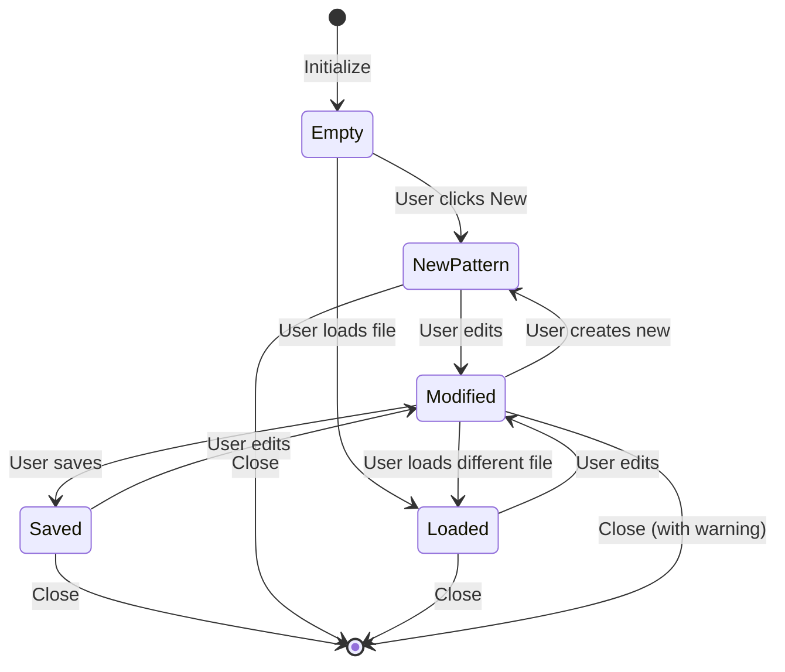
```mermaid
stateDiagram-v2
    [*] --> Empty: Initialize
    Empty --> NewPattern: User clicks New
    Empty --> Loaded: User loads file
    
    NewPattern --> Modified: User edits
    Loaded --> Modified: User edits
    
    Modified --> Saved: User saves
    Modified --> NewPattern: User creates new
    Modified --> Loaded: User loads different file
    
    Saved --> Modified: User edits
    Saved --> [*]: Close
    
    NewPattern --> [*]: Close
    Loaded --> [*]: Close
    Modified --> [*]: Close (with warning)
```

---

## 8. State Transition: Layer Compositing

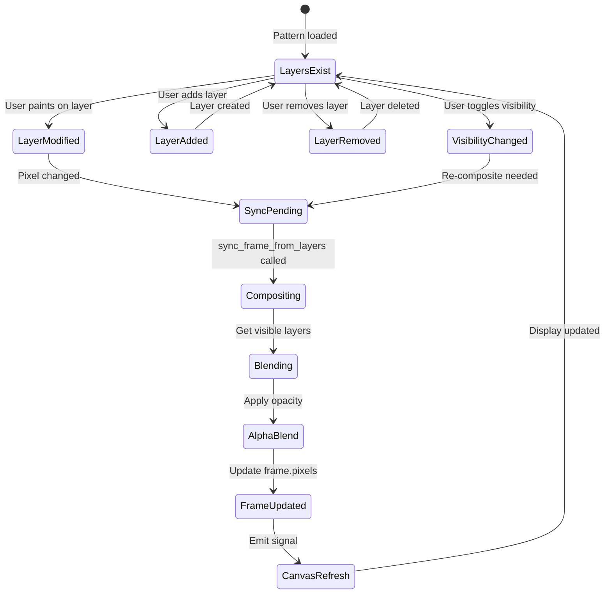
```mermaid
stateDiagram-v2
    [*] --> LayersExist: Pattern loaded
    
    LayersExist --> LayerModified: User paints on layer
    LayerModified --> SyncPending: Pixel changed
    
    SyncPending --> Compositing: sync_frame_from_layers called
    Compositing --> Blending: Get visible layers
    Blending --> AlphaBlend: Apply opacity
    AlphaBlend --> FrameUpdated: Update frame.pixels
    
    FrameUpdated --> CanvasRefresh: Emit signal
    CanvasRefresh --> LayersExist: Display updated
    
    LayersExist --> LayerAdded: User adds layer
    LayerAdded --> LayersExist: Layer created
    
    LayersExist --> LayerRemoved: User removes layer
    LayerRemoved --> LayersExist: Layer deleted
    
    LayersExist --> VisibilityChanged: User toggles visibility
    VisibilityChanged --> SyncPending: Re-composite needed
```

---

## 9. Data Flow: LMS Export

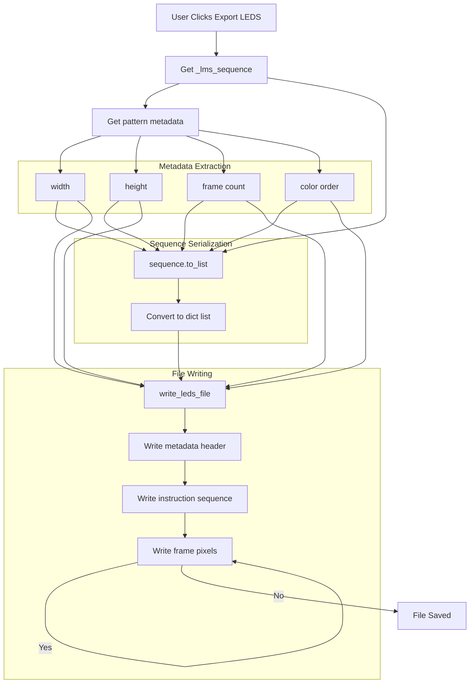
```mermaid
flowchart TD
    START[User Clicks Export LEDS]
    GET_SEQUENCE[Get _lms_sequence]
    GET_PATTERN[Get pattern metadata]
    
    subgraph "Metadata Extraction"
        WIDTH[width]
        HEIGHT[height]
        FRAMES[frame count]
        COLOR_ORDER[color order]
    end
    
    subgraph "Sequence Serialization"
        SERIALIZE[sequence.to_list]
        INSTRUCTIONS[Convert to dict list]
    end
    
    subgraph "File Writing"
        WRITE[write_leds_file]
        METADATA[Write metadata header]
        SEQ_DATA[Write instruction sequence]
        FRAME_DATA{Include frame data?}
    end
    
    START --> GET_SEQUENCE
    GET_SEQUENCE --> GET_PATTERN
    GET_PATTERN --> WIDTH
    GET_PATTERN --> HEIGHT
    GET_PATTERN --> FRAMES
    GET_PATTERN --> COLOR_ORDER
    
    WIDTH --> SERIALIZE
    HEIGHT --> SERIALIZE
    FRAMES --> SERIALIZE
    COLOR_ORDER --> SERIALIZE
    
    GET_SEQUENCE --> SERIALIZE
    SERIALIZE --> INSTRUCTIONS
    
    INSTRUCTIONS --> WRITE
    WIDTH --> WRITE
    HEIGHT --> WRITE
    FRAMES --> WRITE
    COLOR_ORDER --> WRITE
    
    WRITE --> METADATA
    METADATA --> SEQ_DATA
    SEQ_DATA --> FRAME_DATA
    FRAME_DATA -->|Yes| FRAME_DATA[Write frame pixels]
    FRAME_DATA -->|No| DONE[File Saved]
```

---

## 10. Component Interaction: Multi-Layer Painting

```mermaid
graph LR
    subgraph "User Interaction"
        CLICK[Canvas Click]
    end
    
    subgraph "DesignToolsTab"
        HANDLER[_on_canvas_pixel_updated]
        BROADCAST{Broadcast?}
        GET_LAYER[Get Active Layer]
    end
    
    subgraph "LayerManager"
        APPLY[apply_pixel]
        UPDATE_LAYER[Update Layer Pixels]
        SYNC[sync_frame_from_layers]
        COMPOSITE[get_composite_pixels]
    end
    
    subgraph "PatternState"
        FRAME[Frame.pixels]
    end
    
    subgraph "Canvas"
        DISPLAY[Display Composite]
    end
    
    CLICK --> HANDLER
    HANDLER --> GET_LAYER
    GET_LAYER --> BROADCAST
    
    BROADCAST -->|Yes| APPLY_ALL[Apply to All Frames]
    BROADCAST -->|No| APPLY_SINGLE[Apply to Current Frame]
    
    APPLY_ALL --> APPLY
    APPLY_SINGLE --> APPLY
    
    APPLY --> UPDATE_LAYER
    UPDATE_LAYER --> SYNC
    SYNC --> COMPOSITE
    COMPOSITE --> FRAME
    FRAME --> DISPLAY
```

---

## 11. Signal Flow: Pattern Modification

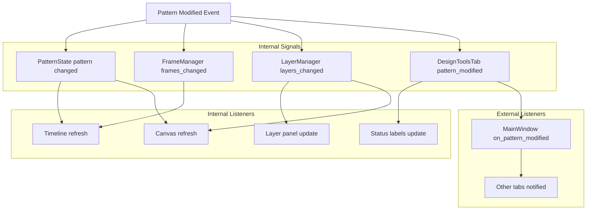
```mermaid
flowchart TD
    START[Pattern Modified Event]
    
    subgraph "Internal Signals"
        PS_SIG[PatternState pattern changed]
        FM_SIG[FrameManager frames_changed]
        LM_SIG[LayerManager layers_changed]
        DTT_SIG[DesignToolsTab pattern_modified]
    end
    
    subgraph "Internal Listeners"
        TIMELINE_LIST[Timeline refresh]
        CANVAS_LIST[Canvas refresh]
        LAYER_LIST[Layer panel update]
        STATUS_LIST[Status labels update]
    end
    
    subgraph "External Listeners"
        MAINWIN[MainWindow on_pattern_modified]
        OTHER_TABS[Other tabs notified]
    end
    
    START --> PS_SIG
    START --> FM_SIG
    START --> LM_SIG
    START --> DTT_SIG
    
    PS_SIG --> TIMELINE_LIST
    FM_SIG --> TIMELINE_LIST
    LM_SIG --> LAYER_LIST
    
    PS_SIG --> CANVAS_LIST
    LM_SIG --> CANVAS_LIST
    
    DTT_SIG --> STATUS_LIST
    DTT_SIG --> MAINWIN
    
    MAINWIN --> OTHER_TABS
```

---

## Diagram Usage Notes

1. **Architecture Component Diagram**: Shows high-level component relationships
2. **Data Flow Diagrams**: Illustrate how data moves through the system
3. **Sequence Diagrams**: Show step-by-step interactions for specific workflows
4. **State Transition Diagrams**: Show how system state changes over time
5. **Component Interaction Diagrams**: Show how components work together

These diagrams can be:
- Embedded in documentation using Mermaid renderers
- Exported as images using Mermaid CLI or online tools
- Used as reference during development
- Included in presentations or architecture reviews

---

## 12. Sequence Diagram: LMS Automation Workflow

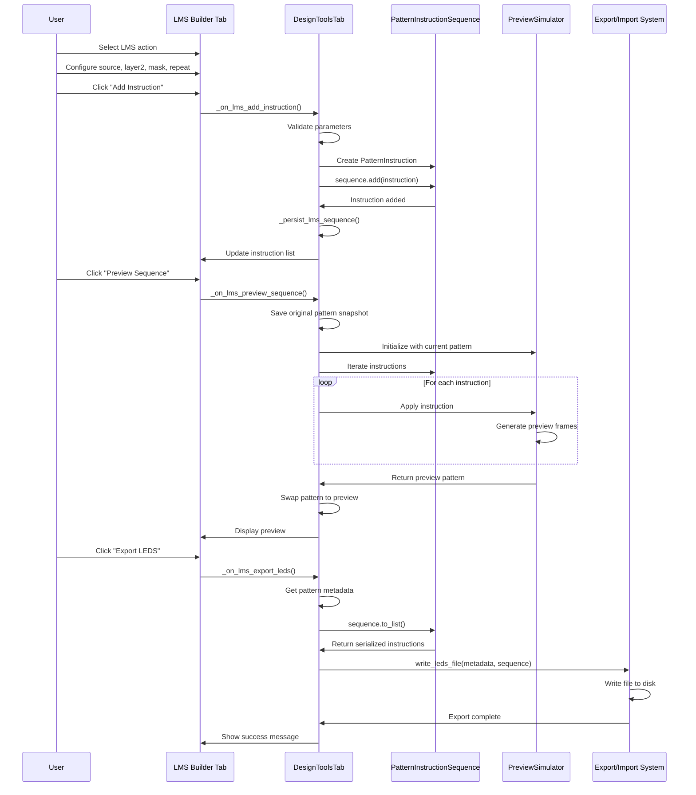
```mermaid
sequenceDiagram
    participant User
    participant UI as LMS Builder Tab
    participant DTT as DesignToolsTab
    participant PIS as PatternInstructionSequence
    participant PS as PreviewSimulator
    participant EXPORT as Export/Import System
    
    User->>UI: Select LMS action
    User->>UI: Configure source, layer2, mask, repeat
    User->>UI: Click "Add Instruction"
    UI->>DTT: _on_lms_add_instruction()
    DTT->>DTT: Validate parameters
    DTT->>PIS: Create PatternInstruction
    DTT->>PIS: sequence.add(instruction)
    PIS->>DTT: Instruction added
    DTT->>DTT: _persist_lms_sequence()
    DTT->>UI: Update instruction list
    
    User->>UI: Click "Preview Sequence"
    UI->>DTT: _on_lms_preview_sequence()
    DTT->>DTT: Save original pattern snapshot
    DTT->>PS: Initialize with current pattern
    DTT->>PIS: Iterate instructions
    loop For each instruction
        DTT->>PS: Apply instruction
        PS->>PS: Generate preview frames
    end
    PS->>DTT: Return preview pattern
    DTT->>DTT: Swap pattern to preview
    DTT->>UI: Display preview
    
    User->>UI: Click "Export LEDS"
    UI->>DTT: _on_lms_export_leds()
    DTT->>DTT: Get pattern metadata
    DTT->>PIS: sequence.to_list()
    PIS->>DTT: Return serialized instructions
    DTT->>EXPORT: write_leds_file(metadata, sequence)
    EXPORT->>EXPORT: Write file to disk
    EXPORT->>DTT: Export complete
    DTT->>UI: Show success message
```

---

## 13. Sequence Diagram: Effects Application Workflow

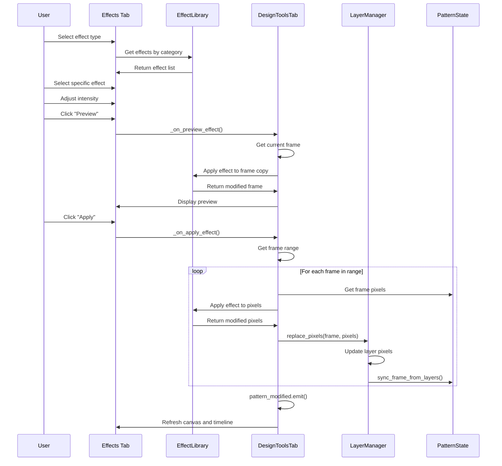
```mermaid
sequenceDiagram
    participant User
    participant UI as Effects Tab
    participant EL as EffectLibrary
    participant DTT as DesignToolsTab
    participant LM as LayerManager
    participant PS as PatternState
    
    User->>UI: Select effect type
    UI->>EL: Get effects by category
    EL->>UI: Return effect list
    User->>UI: Select specific effect
    User->>UI: Adjust intensity
    User->>UI: Click "Preview"
    UI->>DTT: _on_preview_effect()
    DTT->>DTT: Get current frame
    DTT->>EL: Apply effect to frame copy
    EL->>DTT: Return modified frame
    DTT->>UI: Display preview
    
    User->>UI: Click "Apply"
    UI->>DTT: _on_apply_effect()
    DTT->>DTT: Get frame range
    loop For each frame in range
        DTT->>PS: Get frame pixels
        DTT->>EL: Apply effect to pixels
        EL->>DTT: Return modified pixels
        DTT->>LM: replace_pixels(frame, pixels)
        LM->>LM: Update layer pixels
        LM->>PS: sync_frame_from_layers()
    end
    DTT->>DTT: pattern_modified.emit()
    DTT->>UI: Refresh canvas and timeline
```

---

## 14. Sequence Diagram: Image Import Workflow

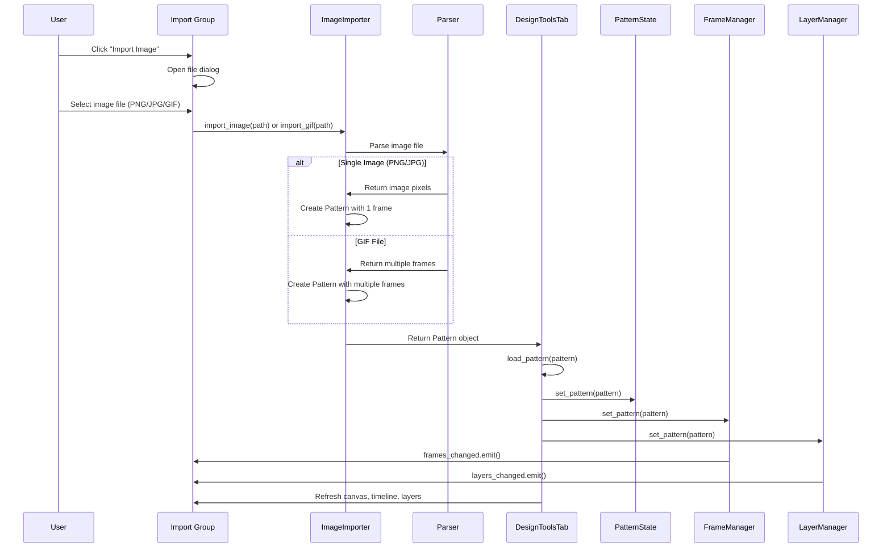
```mermaid
sequenceDiagram
    participant User
    participant UI as Import Group
    participant II as ImageImporter
    participant Parser
    participant DTT as DesignToolsTab
    participant PS as PatternState
    participant FM as FrameManager
    participant LM as LayerManager
    
    User->>UI: Click "Import Image"
    UI->>UI: Open file dialog
    User->>UI: Select image file (PNG/JPG/GIF)
    UI->>II: import_image(path) or import_gif(path)
    II->>Parser: Parse image file
    alt Single Image (PNG/JPG)
        Parser->>II: Return image pixels
        II->>II: Create Pattern with 1 frame
    else GIF File
        Parser->>II: Return multiple frames
        II->>II: Create Pattern with multiple frames
    end
    II->>DTT: Return Pattern object
    DTT->>DTT: load_pattern(pattern)
    DTT->>PS: set_pattern(pattern)
    DTT->>FM: set_pattern(pattern)
    DTT->>LM: set_pattern(pattern)
    FM->>UI: frames_changed.emit()
    LM->>UI: layers_changed.emit()
    DTT->>UI: Refresh canvas, timeline, layers
```

---

## 15. Sequence Diagram: Export Workflow (Detailed)

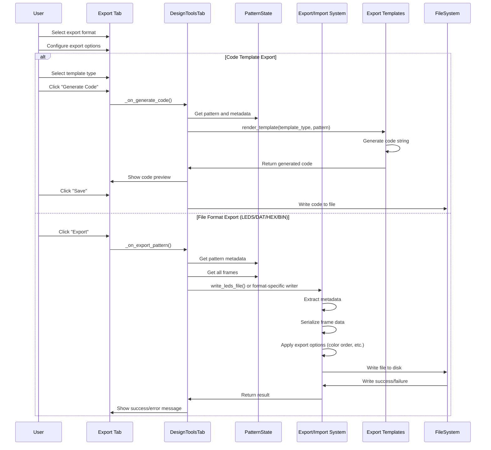
```mermaid
sequenceDiagram
    participant User
    participant UI as Export Tab
    participant DTT as DesignToolsTab
    participant PS as PatternState
    participant EXPORT as Export/Import System
    participant TEMPLATE as Export Templates
    participant FileSystem
    
    User->>UI: Select export format
    User->>UI: Configure export options
    alt Code Template Export
        User->>UI: Select template type
        User->>UI: Click "Generate Code"
        UI->>DTT: _on_generate_code()
        DTT->>PS: Get pattern and metadata
        DTT->>TEMPLATE: render_template(template_type, pattern)
        TEMPLATE->>TEMPLATE: Generate code string
        TEMPLATE->>DTT: Return generated code
        DTT->>UI: Show code preview
        User->>UI: Click "Save"
        DTT->>FileSystem: Write code to file
    else File Format Export (LEDS/DAT/HEX/BIN)
        User->>UI: Click "Export"
        UI->>DTT: _on_export_pattern()
        DTT->>PS: Get pattern metadata
        DTT->>PS: Get all frames
        DTT->>EXPORT: write_leds_file() or format-specific writer
        EXPORT->>EXPORT: Extract metadata
        EXPORT->>EXPORT: Serialize frame data
        EXPORT->>EXPORT: Apply export options (color order, etc.)
        EXPORT->>FileSystem: Write file to disk
        FileSystem->>EXPORT: Write success/failure
        EXPORT->>DTT: Return result
        DTT->>UI: Show success/error message
    end
```

---

## 16. Sequence Diagram: Layer Compositing Detailed Flow

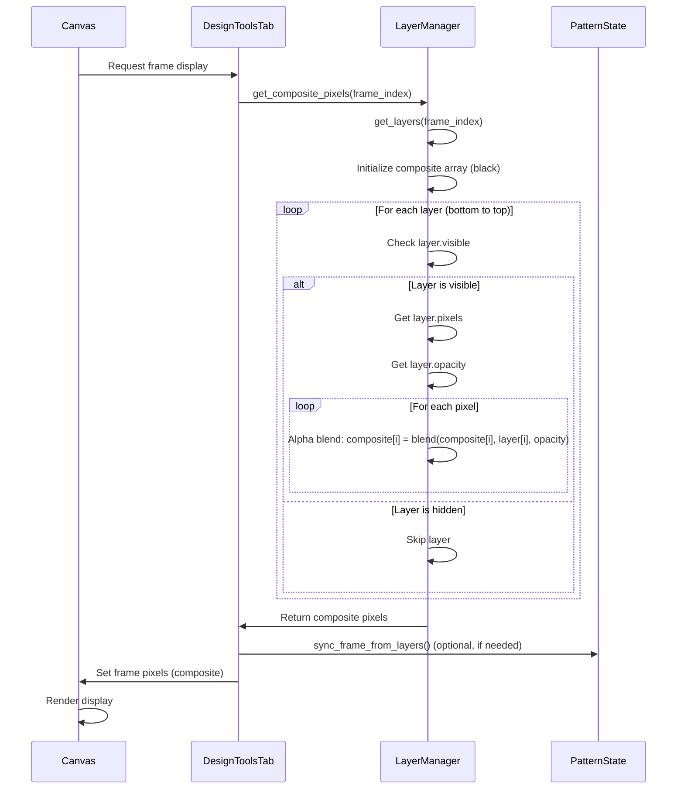
```mermaid
sequenceDiagram
    participant Canvas
    participant DTT as DesignToolsTab
    participant LM as LayerManager
    participant PS as PatternState
    
    Canvas->>DTT: Request frame display
    DTT->>LM: get_composite_pixels(frame_index)
    LM->>LM: get_layers(frame_index)
    LM->>LM: Initialize composite array (black)
    
    loop For each layer (bottom to top)
        LM->>LM: Check layer.visible
        alt Layer is visible
            LM->>LM: Get layer.pixels
            LM->>LM: Get layer.opacity
            loop For each pixel
                LM->>LM: Alpha blend: composite[i] = blend(composite[i], layer[i], opacity)
            end
        else Layer is hidden
            LM->>LM: Skip layer
        end
    end
    
    LM->>DTT: Return composite pixels
    DTT->>PS: sync_frame_from_layers() (optional, if needed)
    DTT->>Canvas: Set frame pixels (composite)
    Canvas->>Canvas: Render display
```

---

**End of Diagrams Document**

