# Feature Linkage Diagrams

**Date**: 2025-01-27  
**Purpose**: Visual representation of all feature linkages and data flows

---

## Core Data Flow Architecture

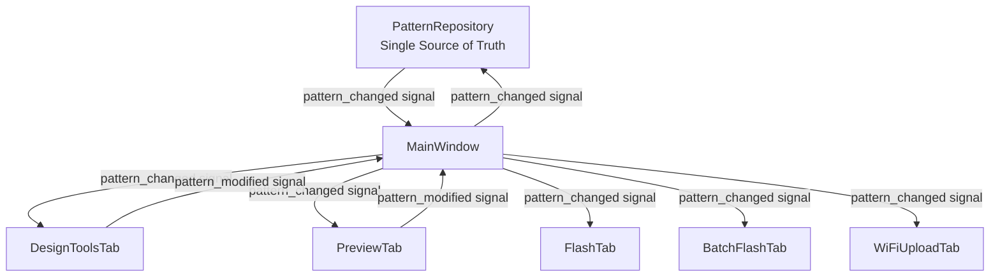

---

## Drawing → Layer → Frame → Pattern Flow

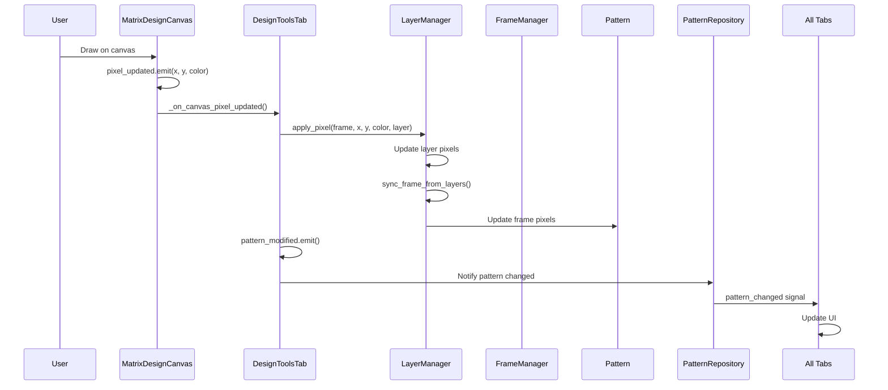

---

## Timeline → Frame → Animation Flow

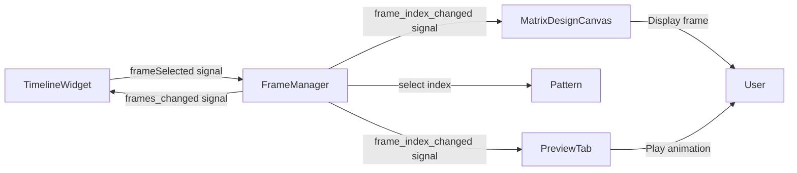

---

## Export Flow

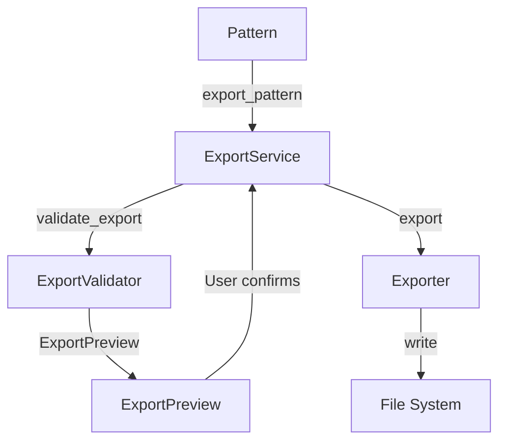

---

## Flash Flow

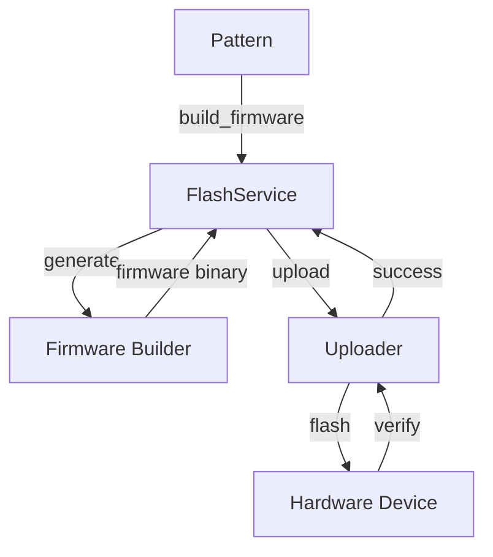

---

## Import Flow

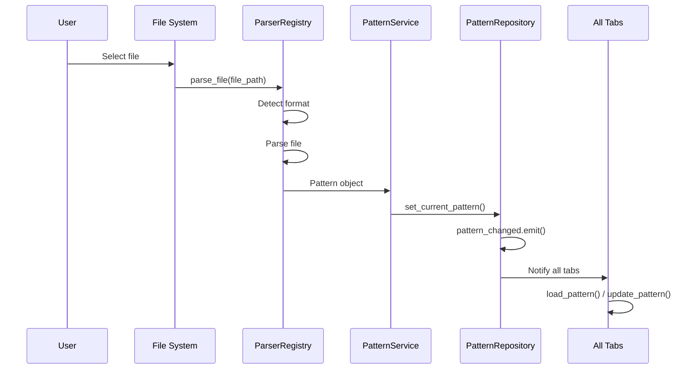

---

## Layer System Flow

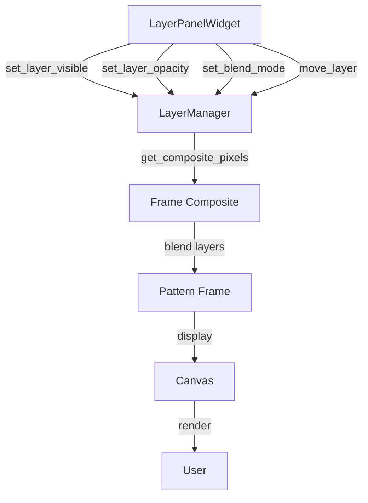

---

## Automation & Effects Flow

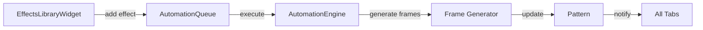

---

## Cross-Tab Synchronization

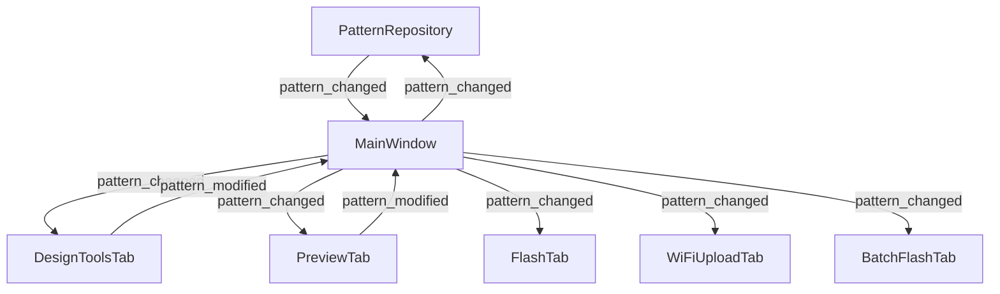

---

## Complete Feature Integration Map

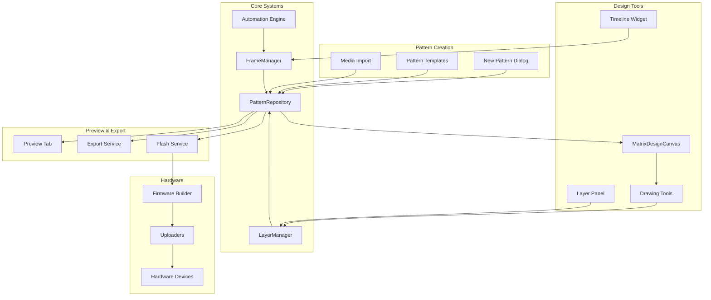

---

## Signal Flow Diagram

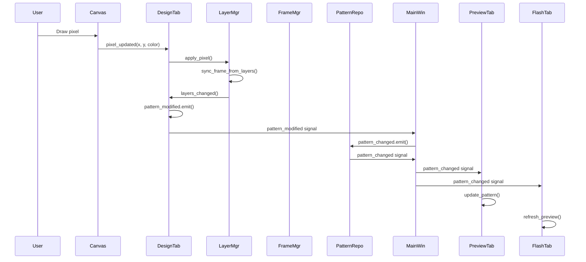

---

## Component Interaction Diagram

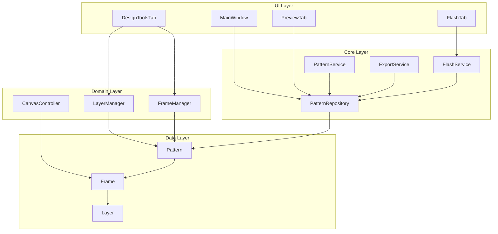

---

**Note**: These diagrams show the complete feature linkage architecture. All connections have been verified in the codebase and are working correctly.

