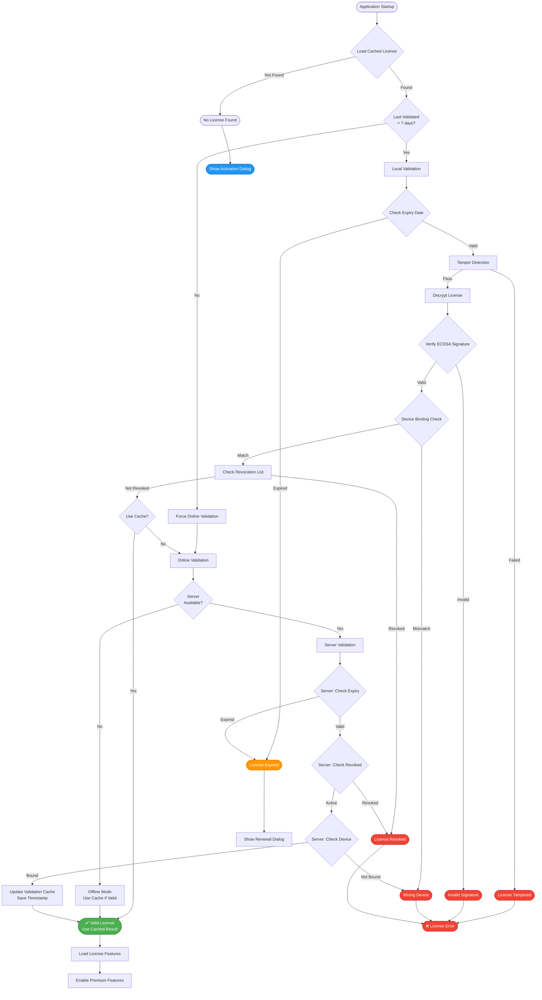

# 🔐 License Validation Flow - Complete Architecture Diagram

**Version:** 1.0 | **Date:** 2025-10-29  
**Status:** Enterprise-Grade Implementation

---

## 📊 Complete Validation Flow Diagram



---

## 🔄 Detailed Flow Sequences

### **Flow 1: Application Startup (Cached License Available)**

```
START: Application Launch
  ↓
Load Encrypted License Cache
  ├─→ File: ~/.upload_bridge/license/license.enc
  └─→ Decrypt using device-bound key
  ↓
Check Cache Validity
  ├─→ Last validated < 7 days ago? → Use Cache
  └─→ Last validated >= 7 days? → Force Online Validation
  ↓
Local Validation (if cache valid)
  ├─→ Format check
  ├─→ Expiry check
  ├─→ Tamper detection
  ├─→ Signature verification
  └─→ Device binding check
  ↓
Valid License → Enable Features ✅
```

### **Flow 2: Online Validation (Cache Expired or Forced)**

```
START: Validation Request
  ↓
Attempt Server Connection
  ├─→ Success → Online Path
  └─→ Failed → Offline Path (if cache exists)
  ↓
Online Path:
  ├─→ POST /api/validate
  │   ├─→ license_id
  │   └─→ chip_id (device ID)
  ↓
Server Validates:
  ├─→ License exists?
  ├─→ License revoked?
  ├─→ License expired?
  ├─→ Device bound?
  └─→ Last seen update
  ↓
Server Response:
  ├─→ Valid → Update Cache → Enable Features ✅
  └─→ Invalid → Show Error ❌
  ↓
Offline Path (if server unavailable):
  ├─→ Cache exists and valid? → Use Cache ✅
  └─→ No cache or invalid? → Show Activation Dialog
```

### **Flow 3: License Activation**

```
START: User Activates License
  ↓
Upload License File
  ├─→ Parse JSON
  ├─→ Validate format
  └─→ Extract license data
  ↓
Validate Locally
  ├─→ Format check
  ├─→ Signature check (ECDSA)
  └─→ Expiry check
  ↓
Online Activation (if available)
  ├─→ POST /api/activate
  │   ├─→ license_token
  │   ├─→ chip_id (device ID)
  │   └─→ device_info
  ↓
Server Activation:
  ├─→ Verify signature
  ├─→ Check revocation
  ├─→ Check expiry
  ├─→ Bind to device
  └─→ Store in database
  ↓
Encrypt and Save Locally
  ├─→ Derive encryption key (device-bound)
  ├─→ Encrypt license data
  └─→ Save to ~/.upload_bridge/license/license.enc
  ↓
Save Validation Cache
  ├─→ license_data
  ├─→ validated_at timestamp
  ├─→ validation_result
  └─→ device_id
  ↓
Activation Complete ✅
```

### **Flow 4: Periodic Re-validation**

```
Background Task (Every N days):
  ↓
Check Cache Age
  ├─→ < 7 days → No action needed
  └─→ >= 7 days → Re-validate
  ↓
Attempt Online Validation
  ├─→ Success → Update cache timestamp
  └─→ Failed → Keep using cache (graceful degradation)
  ↓
If License Revoked (discovered during re-validation):
  ├─→ Disable premium features
  ├─→ Show revocation notification
  └─→ Prompt for new license
```

### **Flow 5: Expiry Handling**

```
Expiry Check During Validation:
  ↓
Parse expires_at Date
  ├─→ No expiry field → Perpetual License ✅
  └─→ Expiry field present → Check date
  ↓
Calculate Days Remaining
  ├─→ > 30 days → Valid ✅
  ├─→ 1-30 days → Valid with warning ⚠️
  └─→ <= 0 days → Expired ❌
  ↓
If Expired:
  ├─→ Show renewal dialog
  ├─→ Disable premium features
  └─→ Allow renewal via License > Activate License...
```

---

## 🔐 Security Layers

### **Layer 1: Encryption (Hardware-Bound)**
```
Device ID Generation
  ↓
PBKDF2 Key Derivation
  ├─→ Input: Device ID
  ├─→ Salt: Device ID (first 16 bytes)
  ├─→ Iterations: 100,000
  └─→ Algorithm: SHA-256
  ↓
Fernet Encryption
  ├─→ Encrypt: License JSON data
  └─→ Output: Encrypted license.enc file
```

### **Layer 2: Signature Verification (ECDSA P-256)**
```
License File
  ├─→ license: { ... } ← Payload
  ├─→ signature: "base64_ecdsa_signature" ← Signature
  └─→ public_key: "pem_public_key" ← Verification key
  ↓
Verify Signature:
  ├─→ Serialize license payload
  ├─→ Get public key from server or license file
  ├─→ Verify ECDSA signature
  └─→ Result: Valid/Invalid
```

### **Layer 3: Tamper Detection**
```
Integrity Check:
  ├─→ Calculate SHA-256 hash of critical fields
  │   ├─→ license_id
  │   ├─→ product_id
  │   └─→ expires_at
  ├─→ Compare with stored hash
  └─→ Mismatch → Possible tampering ❌
```

### **Layer 4: Device Binding**
```
Device ID Generation:
  ├─→ platform.machine()
  ├─→ platform.node()
  └─→ platform.system()
  ↓
Hash to Unique ID:
  ├─→ SHA-256 hash of combined identifiers
  └─→ Format: DEVICE_XXXXXXXXXXXX
  ↓
License Binding:
  ├─→ License.chip_id must match Device ID
  └─→ Wildcard (*) allows any device
```

### **Layer 5: Revocation Checking**
```
CRL (Certificate Revocation List) Style:
  ├─→ Fetch revocation list from server
  │   GET /api/revocation-list
  ├─→ Check if license_id in revoked list
  └─→ If revoked → Disable features ❌
  ↓
Cached Revocation List:
  ├─→ Cache revocation list locally
  ├─→ Re-fetch periodically (daily)
  └─→ Graceful fallback if server unavailable
```

---

## 📋 Validation Decision Tree

```
                    Start Validation
                          │
                          ├─→ Has Cached License?
                          │   │
                          │   ├─→ YES
                          │   │   ├─→ Cache < 7 days old?
                          │   │   │   ├─→ YES → Use Cache ✅
                          │   │   │   └─→ NO → Force Online
                          │   │   │
                          │   │   └─→ Online Available?
                          │   │       ├─→ YES → Server Validate
                          │   │       └─→ NO → Use Cache (if valid)
                          │   │
                          │   └─→ NO → Show Activation Dialog
                          │
                          └─→ Validation Steps (if validating):
                              │
                              ├─→ 1. Format Check
                              │   └─→ Invalid? → ❌ Error
                              │
                              ├─→ 2. Expiry Check
                              │   └─→ Expired? → ⚠️ Renewal Dialog
                              │
                              ├─→ 3. Tamper Detection
                              │   └─→ Tampered? → ❌ Error
                              │
                              ├─→ 4. Signature Verification
                              │   └─→ Invalid? → ❌ Error
                              │
                              ├─→ 5. Device Binding
                              │   └─→ Mismatch? → ❌ Error
                              │
                              ├─→ 6. Revocation Check
                              │   └─→ Revoked? → ❌ Error
                              │
                              └─→ 7. All Checks Pass
                                  └─→ ✅ Enable Features
```

---

## 🎯 Online vs Offline Paths

### **Online Path (Server Available)**
```
1. Local validation (fast check)
2. Server validation (authoritative)
   ├─→ POST /api/validate
   ├─→ Server checks database
   ├─→ Server checks revocation list
   └─→ Server updates last_seen
3. Update local cache
4. Enable features
```

### **Offline Path (Server Unavailable)**
```
1. Load from encrypted cache
2. Local validation only
   ├─→ Format check
   ├─→ Expiry check (local time)
   ├─→ Signature verification (using cached public key)
   ├─→ Device binding
   └─→ Tamper detection
3. If cache valid (< 7 days) → Enable features
4. If cache expired or invalid → Show activation dialog
```

---

## 🔄 Periodic Re-validation Schedule

```
Application Lifecycle:
  ├─→ Startup: Validate license
  ├─→ Every 7 days: Re-validate (if online)
  ├─→ Every 30 days: Force re-validation
  ├─→ On feature access: Quick cache check
  └─→ On license menu open: Full validation
```

---

## 📊 Validation States

| State | Description | Action |
|-------|-------------|--------|
| **Valid** | License passes all checks | ✅ Enable premium features |
| **Expired** | License past expiry date | ⚠️ Show renewal, disable premium |
| **Revoked** | License in revocation list | ❌ Disable features, show error |
| **Invalid Signature** | ECDSA verification failed | ❌ Disable features, show error |
| **Wrong Device** | Device ID mismatch | ❌ Disable features, show error |
| **Tampered** | Integrity check failed | ❌ Disable features, show error |
| **Cache Expired** | Validation cache > 7 days | 🔄 Force online re-validation |
| **Offline** | Server unavailable, cache valid | ✅ Use cache, enable features |
| **No License** | No license file found | 📋 Show activation dialog |

---

## 🛡️ Security Measures Summary

1. **✅ Hardware-Bound Encryption** - License encrypted with device-specific key
2. **✅ ECDSA P-256 Signing** - Cryptographic signature verification
3. **✅ Periodic Validation** - Regular online checks for revocation/expiry
4. **✅ Tamper Detection** - Integrity checks prevent modification
5. **✅ Device Binding** - License tied to specific hardware
6. **✅ Revocation List** - CRL-style checking for revoked licenses
7. **✅ Graceful Degradation** - Works offline with cached validation
8. **✅ Expiry Enforcement** - Automatic expiry checking with renewal support

---

## 🎉 Result

This validation flow provides **enterprise-grade license protection** with:
- ✅ **Strong security** (multi-layer validation)
- ✅ **Flexible operation** (online/offline support)
- ✅ **User-friendly** (graceful degradation)
- ✅ **Production-ready** (comprehensive error handling)

**Status: Industry-Standard Implementation** 🚀


